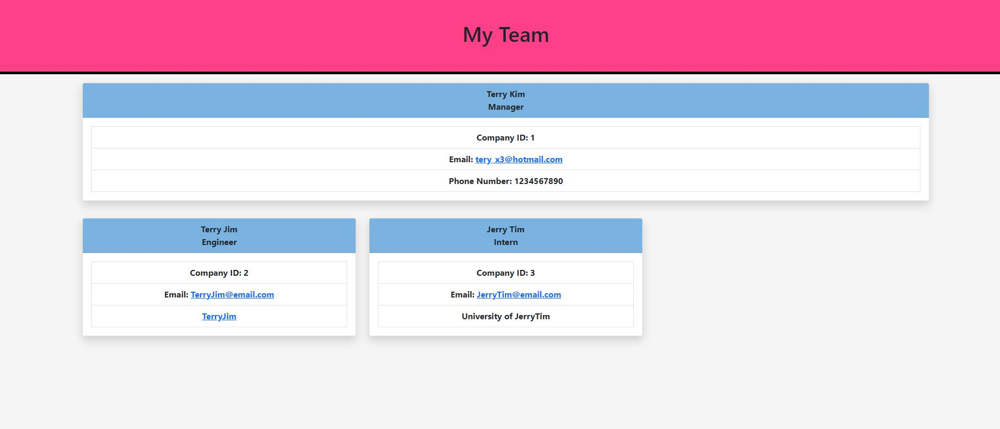

# Team Profile Generator by Terry Kim
Team Profile Generator by Terry Kim

This is a node.js file to generate a Team Profile by asking the user specific roles for new employees. 
It will ask the following:

-Adding Manager information including name, id, and phone number

-Asking to add a member

-If yes, it will ask whether they want to add an engineer or intern

-If no, it will ask the same prompt as above, but it will just complete the terminal command

-If engineer was selected, it will ask information about name, id, github info, and email

-If intern was selected, it will ask information about name, id, school name, and email

## Screenshots

Video Link:
https://drive.google.com/file/d/1p3RpE3dQGMH2HDepczOVwKwRo9hkcZE5/view
## Authors

- [@Terry Kim](https://github.com/TeryKing)

## Acknowledgements

Georgia Tech Coding Bootcamp: https://bootcamp.pe.gatech.edu/coding/

W3Schools: https://www.w3schools.com/

MDN : https://developer.mozilla.org/en-US/

Readme.so: https://readme.so/

## Feedback

If you have any feedback, please reach out to me at Tery_x3@hotmail.com

